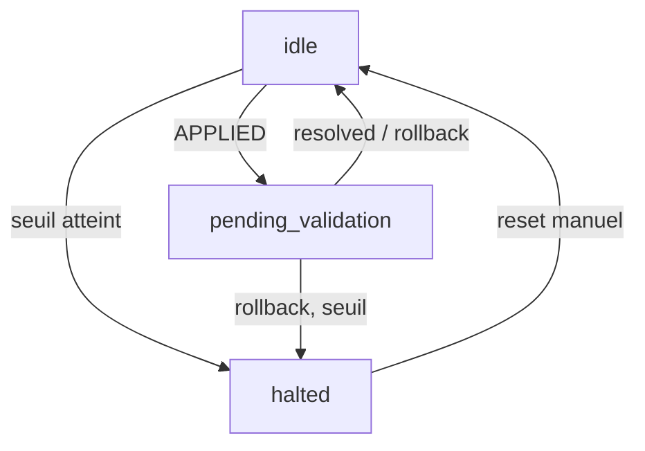
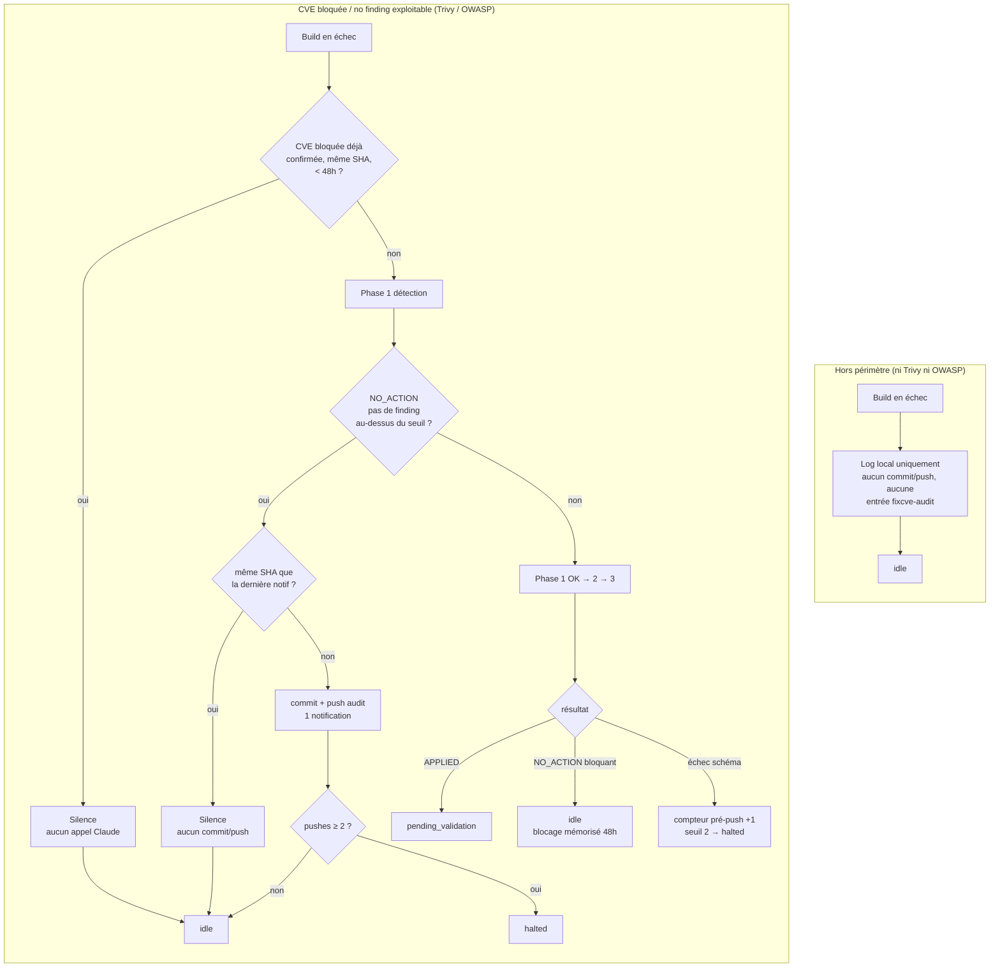

# Remédiation CVE automatisée (fixcve-auto)

Automatisation complète de la remédiation des CVE bloquantes détectées par Trivy ou OWASP Dependency-Check dans le pipeline `RHDemo-CI`, **sans validation humaine**. Complète le skill interactif `/fixcve` (`.claude/skills/fixcve/SKILL.md`) qui reste disponible pour un usage manuel.

---

## Architecture

```text
crontab (toutes les 15 min)
   └─> rhDemo/scripts/fixcve-auto-poll.sh   (bash + jq + curl + python3, PAS de LLM)
         │
         ├─ Phase A (idle) : détecte un nouveau build Jenkins en échec Trivy/OWASP,
         │     puis enchaîne 3 étapes à privilèges disjoints (voir "Séparation
         │     en 3 phases" ci-dessous) :
         │       1. fixcve-detect.py      -> detected.json   (script déterministe, PAS de LLM)
         │       2. /fixcve-auto-lookup   -> lookup.json     (Claude)
         │       3. /fixcve-auto-apply    -> commit + push   (Claude)
         │     un validateur de schéma déterministe (fixcve-validate-json.py)
         │     s'exécute entre chaque étape ; tout échec (schéma invalide,
         │     pas de résultat exploitable) arrête le cycle sans invoquer la
         │     phase suivante ni toucher git — voir "Traçabilité et échecs".
         │
         └─ Phase B (pending_validation) : vérifie le build CI suivant
               ├─ SUCCESS  → marque résolu
               └─ FAILURE  → git revert automatique + halte après 2 rollbacks consécutifs
```

Le polling lui-même ne fait **aucun appel LLM** — Claude Code n'est invoqué que
pour les étapes qui demandent une vraie recherche/décision (recherche de
correctif, rédaction de suppression, édition de fichiers), pas pour
l'extraction mécanique des CVE bloquantes (phase 1), qui est un script pur.

---

## Séparation en 3 phases

Motivation : dans la conception initiale (une seule invocation `claude -p`), le
même contexte LLM cumulait à la fois l'accès à du contenu externe non fiable
(rapports Trivy/OWASP, réponses Maven Central/npm — descriptions de CVE dont
la source ultime est publique et non maîtrisée), les credentials Jenkins, et
les droits git push. C'est la combinaison classique dite du « lethal trifecta »
(contenu non fiable + accès privé + capacité d'action externe) : une injection
de prompt réussie via une description de CVE forgée aurait pu, en un seul
contexte, exfiltrer un credential ou pousser du code malveillant.

Le pipeline est donc scindé en 3 étapes à permissions disjointes, chacune
n'ayant accès qu'à ce qui est strictement nécessaire à son rôle :

| Phase | Implémentation | Détient | Ne détient pas | Touche du contenu externe non fiable |
| --- | --- | --- | --- | --- |
| 1. Détection | [`rhDemo/scripts/fixcve-detect.py`](../scripts/fixcve-detect.py) — **script déterministe, aucun LLM** | Accès Jenkins (lecture, via curl direct — jamais `claude -p`, donc jamais soumis au moteur de permissions) | git, npm/Maven/Docker, aucun credential | Oui (rapports Trivy/OWASP) — **sans conséquence : pas de LLM, donc aucune cible pour une injection de prompt** |
| 2. Recherche de correctif | `.claude/skills/fixcve-auto-lookup/SKILL.md` (Claude) | Accès Maven Central (`fixcve-maven-lookup.sh`), OSV.dev (`fixcve-osv-lookup.sh`), tags de registre (`fixcve-registry-tags-lookup.sh`), `npm audit --json`, `docker manifest inspect` | Jenkins, git, Edit | Oui — **seule phase à la fois exposée à un LLM et sans aucun secret** |
| 3. Application | `.claude/skills/fixcve-auto-apply/SKILL.md` (Claude) | git add/commit/push, Edit des fichiers de remédiation | Jenkins, Maven Central/npm/Docker en direct (digest déjà résolu en phase 2) | Non — ne lit que les fichiers structurés déjà validés |

### Pourquoi la phase 1 est un script plutôt qu'un skill Claude

- La détection ne demande aucun jugement : seuil CVSS fixe (≥ 7 pour OWASP DC, sévérité `CRITICAL` pour Trivy), extraction mécanique de champs, aucune décision de remédiation.
- C'est le même type de tâche déterministe que `fixcve-auto-poll.sh` ou `fixcve-audit-render.sh` traitent déjà sans LLM.
- Sans LLM, il n'y a aucune cible pour une injection de prompt — la question de la fiabilité du contenu Trivy/OWASP devient sans objet.
- Les schémas d'extraction (JSON Trivy, HTML OWASP DC) sont construits et vérifiés contre de vrais rapports du projet — voir les commentaires de [`fixcve-detect.py`](../scripts/fixcve-detect.py) pour le détail des cas réels couverts (identifiants GHSA en plus des CVE, `CVSS` multi-sources, `FixedVersion` multi-valeurs conservées en entier dans `fixed_versions`, avisories ne portant qu'un score CVSS v4...).
- Même si la phase 2 (seule exposée à l'injection) était compromise, elle ne peut produire qu'un fichier erroné — ni exfiltrer un secret, ni pousser de code, faute d'accès git.

### Wrappers réseau dédiés (pas de `curl` générique) — phase 2 uniquement

Ces wrappers défendent contre un cas précis : un `claude -p` (donc soumis au
moteur de permissions Claude Code) à qui l'on donnerait un accès `curl` large
pourrait, via une injection de prompt, faire basculer une requête en écriture
ou viser un hôte arbitraire — un filtrage de flags curl est contournable
(`-d`, `-K`/`--config`, `--upload-file` ne sont pas toujours visibles dans un
simple filtre de préfixe). Chaque accès réseau de la **phase 2** (seule phase
invoquée via `claude -p` à toucher un service externe) passe donc par un
wrapper à usage unique qui construit lui-même l'URL et n'accepte que des
paramètres typés, jamais une URL ou des flags curl :

- [`rhDemo/scripts/fixcve-maven-lookup.sh`](../scripts/fixcve-maven-lookup.sh) : hôte `search.maven.org` figé, `groupId`/`artifactId` validés par regex avant construction de l'URL — aucun SSRF possible.
- [`rhDemo/scripts/fixcve-osv-lookup.sh`](../scripts/fixcve-osv-lookup.sh) : hôte `api.osv.dev` figé, revérifie si une CVE affectant un paquet système (Alpine/Debian/Ubuntu) dans une image Docker est désormais corrigée — via l'identifiant d'avisory prévisible de chaque distribution (`<DISTRO>-<CVE_ID>`), jamais un nom de paquet fourni par l'appelant (voir « Vérification des CVE Alpine/Debian/Ubuntu » dans « Points d'attention » pour le piège que ça évite).
- [`rhDemo/scripts/fixcve-registry-tags-lookup.sh`](../scripts/fixcve-registry-tags-lookup.sh) : énumère les tags publiés d'une image de conteneur tierce (quay.io / Docker Hub / ghcr.io — dépôts publics, jeton ghcr.io anonyme) pour trouver une montée de version quand un composant interne à l'image est vulnérable (`ecosystem: "maven"` mais `image` ≠ `"rhdemo-app"`, ex. `keycloak-services` dans `quay.io/keycloak/keycloak`). N'accepte qu'un jeton d'image parmi une liste blanche (`keycloak`/`nginx`/`postgres`/`nginx-gateway-fabric` — le champ `image` de `detected.json`), mappé dans le script vers un dépôt + une API figés ; renvoie un JSON normalisé indépendant du registre (`tags[]` = versions stables triées). Comble le trou de `docker manifest inspect`, qui ne résout qu'un digest pour un tag déjà choisi et n'énumère pas les versions. Incidents ayant motivé sa création : builds #812 (classification jar/image faite dans 40f707d) puis #813/#815 (la recherche de version restait sur Maven Central, aveugle aux versions d'image — d'où ce wrapper).

La phase 1 (détection) n'a pas ce besoin : `fixcve-detect.py` appelle Jenkins
par un curl direct, comme `curl_jenkins()` dans `fixcve-auto-poll.sh` — les
deux sont des sous-processus lancés directement par le cron, jamais via
`claude -p`, donc jamais soumis à ce moteur de permissions. Un wrapper dédié y
avait un sens du temps de l'ancien skill Claude `/fixcve-auto-detect` ; il est
devenu inutile depuis son remplacement par ce script déterministe.

---

## Garde-fous

| Garde-fou | Détail |
| --- | --- |
| **Working tree propre requis** | Si des modifications locales non committées existent, le script ne touche à rien (évite d'interférer avec un travail en cours). |
| **Branche à jour requise** | Si la branche locale est en retard/divergente par rapport à `origin`, le script s'arrête (pas de merge/rebase automatique). |
| **Rollback automatique** | Si le build Jenkins déclenché par un correctif automatique échoue à nouveau, `git revert` immédiat + push. |
| **Halte après rollbacks répétés** | `MAX_CONSECUTIVE_ROLLBACKS` (2) — voir « Machine à états ». |
| **Halte après échecs pré-push répétés (symétrique)** | `MAX_CONSECUTIVE_PREPUSH_FAILURES` (2), champ `consecutive_prepush_failures`, `reason:"max_consecutive_prepush_failures"` + `failing_stage` dans `automation_halted` — voir « Machine à états » (lane CVE bloquée). |
| **Critères objectifs pour toute suppression/acceptation de risque** | **Critère A (permanent)** : scope `test`/`provided`, OU RetireJS sur une lib JS non utilisée dans `frontend/src`, OU vecteur d'attaque `AV:L`/`AV:P` (accès physique/local), OU devDependency npm. **Critère B (temporaire)** : aucun correctif disponible et CVSS < 9.0 — suppression marquée `[PENDING_UPSTREAM_FIX]`, revérifiée à chaque cycle par `/fixcve-auto-lookup` (phase 2), remplacée par le vrai correctif dès qu'il sort. **CVSS ≥ 9.0 sans correctif** : seule exception restant hors périmètre — blocage documenté, `FIXCVE_AUTO_RESULT: NO_ACTION`, intervention manuelle requise. |
| **Revérification des exclusions temporaires (Critère B)** | À chaque cycle atteignant la phase 2, `/fixcve-auto-lookup` (étape 1 de son `SKILL.md`) scanne `owasp-suppressions.xml`/`.trivyignore.yaml` pour le jeton `[PENDING_UPSTREAM_FIX]` et revérifie Maven Central/npm pour chacune ; si un correctif est sorti, l'entrée est ajoutée à `pending_reverified` dans `lookup.json` et `/fixcve-auto-apply` (phase 3) applique le vrai correctif et retire l'exclusion. Ce mécanisme ne se déclenche que si le pipeline est réinvoqué (un build vert sur une CVE désormais supprimée ne relance plus le pipeline tant qu'aucune autre CVE ne fait échouer le build) — jugé suffisant vu la fréquence d'activation réelle sur ce projet (surface OWASP Dependency-Check large). |
| **Journal d'audit append-only** | `rhDemo/docs/fixcve-audit.jsonl`, versionné, une ligne JSON par événement (détection, échec de phase, application, validation, rollback, halte). N'inclut **pas** les causes hors périmètre (ni Trivy ni OWASP) — voir ligne suivante. |
| **Hors périmètre jamais tracé en git** | Une cause hors périmètre (ex. Selenium flaky) n'a aucune valeur sécurité : journalisée uniquement dans `poll.log` (local, non versionné), jamais committée/poussée. Supprime structurellement le risque de boucle qu'un ancien garde-fou dédié (dédoublonnage par SHA + seuil de halte) corrigeait a posteriori — incident ayant motivé cet ancien garde-fou : builds #772/#774, #796/#797. Sans push, pas de nouveau build Jenkins, donc pas de boucle possible. |
| **Verrou anti-chevauchement** | `flock` sur `~/.config/rhdemo-fixcve/poll.lock` — un cycle CI (~2h max) ne peut pas se chevaucher avec le suivant. |
| **Anti-boucle blocage confirmé** | Champs `blocked_confirmed.{since,source_sha}`, délai `BLOCKED_RECHECK_INTERVAL_SECONDS` (48h) — voir « Machine à états » (lane CVE bloquée). |
| **Anti-boucle no_action en périmètre** | Champs `no_action_confirmed.{since,source_sha}`, `consecutive_no_action_pushes`, seuil `MAX_CONSECUTIVE_NO_ACTION_PUSHES` (2) — voir « Machine à états » (lane CVE bloquée). Couvre le cas où le stage racine EST en périmètre (trivy/owasp) mais `fixcve-detect.py` répond `NO_ACTION` (ex: `owasp_no_finding_above_threshold`), qui lui reste committé (vraie valeur d'audit sécurité). Incident ayant motivé ce garde-fou : builds #799-#802, apparu juste après le correctif d'un ancien garde-fou symétrique côté hors périmètre (retiré depuis, voir ligne précédente), qui n'avait couvert que cette branche-là. |
| **Validation de schéma inter-phases** | Entre chaque invocation Claude, `fixcve-validate-json.py` (déterministe, aucun LLM) rejette tout fichier intermédiaire hors schéma strict (clés inconnues, valeurs hors regex/enum, référence croisée invalide) — voir « Séparation en 3 phases » ci-dessus. Aucune phase suivante n'est invoquée si la précédente échoue cette validation. |
| **Validation par SHA, pas par numéro de build** | Phase B (`pending_validation`) vérifie que `fix_commit_sha` est un ancêtre (ou égal) du commit réellement bâti par le build suivant (`git merge-base --is-ancestor`), pas seulement que son numéro est supérieur à `trigger_build_seen`. Jenkins déclenche un build sur **chaque** push (webhook/poll SCM) — un push sans rapport intercalé entre la publication du correctif et le cycle cron suivant (commit de documentation, PR Renovate...) produit un build qui n'est pas celui du correctif ; sans cette vérification, ce build intercalé serait pris pour la validation et pourrait faire annuler un correctif jamais réellement testé. |
| **Validation locale obligatoire avant push** | `fixcve-auto-apply/SKILL.md` étape 3 : parse XML/YAML du fichier de suppression modifié, puis rejeu local de `./mvnw org.owasp:dependency-check-maven:check`, comparé à `detected.json`, avant tout `git commit`/`git push`. Ce double contrôle couvre deux échecs distincts : un correctif incomplet (le rejeu Maven le révèle) et un fichier de suppression rendu illisible — ex. un `--` littéral dans un commentaire XML (le parse le révèle immédiatement). Quelques secondes suffisent, contre un cycle Jenkins complet (~15+ min) suivi d'un rollback. Ce rejeu utilise le cache NVD de l'hôte (`~/.m2/dependency-check-data`), **distinct** de celui de Jenkins (clé API NVD que l'hôte n'a pas) : fiable pour confirmer la couverture des CVE, pas une simulation identique seconde près — la validation Phase B (Jenkins) reste le filet de sécurité final. |
| **Aucun commentaire XML `<!-- -->` libre pour les suppressions** | Toute justification, même longue, va dans `<notes>` (contenu XML normal, jamais interprété comme commentaire) — jamais dans un bloc `<!-- ... -->` séparé, où un `--` littéral (ex. une commande `npm ... --force` citée dans le texte) casse le parsing de tout le fichier. |
| **Journalisation de la cause réelle d'un rollback** | Phase B enrichit l'événement `validation_failed_rollback` avec `failure_stage` et `failure_detail`, au lieu de se limiter à `commit`/`revert_commit` — un post-mortem sans ça devrait ressortir les logs Jenkins bruts à la main. `capture_failure_context()` (dans `fixcve-auto-poll.sh`) résout le stage **réellement** fautif : `wfapi/describe` impute parfois le `FAILED` au premier stage seulement *sauté* (`skipped due to earlier failure(s)`) quand le vrai coupable lève `error()` dans un bloc `script` suivi d'un `post { always }` — on repart alors de la console pour retrouver le dernier stage réellement entré. Le détail est un extrait du **bloc console de ce stage** (dernières lignes utiles), pas un `grep '[ERROR]'` global qui ratait les vraies lignes d'échec sans ce jeton (ex. `❌ ÉCHEC: 1 vulnérabilités CRITICAL détectées`) et ramassait du bruit (`npm warn deprecated` étiqueté `[ERROR]` par le timestamper). Incident : build #819. |
| **Versions corrigées Trivy : liste complète + garde-fou d'appartenance** | `fixcve-detect.py` conserve **toutes** les versions listées par le champ `FixedVersion` de Trivy dans `fixed_versions` (`fixed_version_hint` n'en reste que le 1er élément, gardé pour compat). `fixcve-auto-lookup/SKILL.md` étape 2 : quand `fixed_versions` est non vide, la `target_version` doit en être l'une (la plus petite strictement supérieure à `installed_version`, même branche mineure en priorité) — `fixcve-validate-json.py` (schéma lookup) **rejette** toute `target_version` hors de cette liste, sauf pour un paquet OS `ecosystem: "docker"` pur (où `fixed_versions` est une version de paquet distro, sans rapport avec le tag d'image). Un `fixed_version_hint`/`fixed_versions` uniquement inférieur ou égal à `installed_version` reste rejeté (rétrograde — branches de maintenance parallèles, ex. Keycloak 26.4.x/26.6.x). Incidents : build #812 (`26.4.15` rétrograde), puis #818/#819 (`26.6.3` retenue par recherche registre alors que Trivy listait `26.4.15, 26.6.6, 26.7.2` — `26.6.3` n'est pas corrigée pour CVE-2026-18963, d'où re-détection CRITICAL et rollback ; la bonne cible `26.6.6` était dans `fixed_versions`). |

---

## Machine à états

États de `status` (`state.json`) et événements déclencheurs :



`idle` et `pending_validation` bouclent aussi sur eux-mêmes sans changer d'état
(build déjà traité, succès, notification déjà émise, ou build de validation
pas encore vu) — non représenté ci-dessus pour la lisibilité.

Détail de la Phase A (`idle`, build en échec) :



---

## Points d'attention

⚠️ Ce document décrit une automatisation qui **committe et pousse du code sur la branche courante sans revue humaine**, y compris des décisions d'acceptation de risque (suppression de CVE). C'est un choix assumé en échange des garde-fous ci-dessus — à désactiver si ces garde-fous ne sont plus jugés suffisants pour le contexte du moment (ex: montée en criticité du projet).

⚠️ **Surface d'injection de prompt** : les phases 2 et 3 parsent du contenu externe non fiable (réponses Maven Central/npm pour la phase 2 ; fichiers déjà structurés et validés pour la phase 3). La phase 1 (détection) est un script déterministe sans LLM (voir « Séparation en 3 phases » ci-dessus) : elle parse aussi du contenu externe (rapports Trivy/OWASP), mais aucune injection de prompt n'y a de prise puisqu'aucun modèle n'y "lit" quoi que ce soit. Pour les phases 2/3, ce contenu n'est jamais lu par la même invocation Claude que celle qui détient les credentials git — chaque phase a son propre fichier `permissions.allow` versionné ([`fixcve-auto-lookup-permissions.json`](../scripts/fixcve-auto-lookup-permissions.json), [`fixcve-auto-apply-permissions.json`](../scripts/fixcve-auto-apply-permissions.json)), strictement plus étroit que l'ancien fichier unique. Toute commande ou fichier hors de la liste de la phase courante est refusé sans prompt (`--permission-mode dontAsk`). Ce scoping s'ajoute aux garde-fous **git** ci-dessus (working tree propre, rollback automatique, halte après rollbacks) et à la validation de schéma inter-phases, qui restent la protection de dernier recours si une commande scoping-compatible était malgré tout détournée.

⚠️ **Fichiers intermédiaires et validateur de schéma** : sous `--permission-mode dontAsk`, `Write` est **toujours refusé**, quel que soit le chemin ou les règles `permissions.allow`. Seul `Edit` fonctionne, et uniquement sur un fichier **déjà existant** dans l'arborescence du `cwd` de lancement. Conséquence : les fichiers intermédiaires doivent vivre dans le clone isolé, pré-créés par `fixcve-auto-poll.sh` (placeholder `{}`) avant chaque invocation, puis remplis par les skills via `Edit`.

Les deux fichiers échangés vivent donc **dans** le clone isolé, gitignorés
(`rhDemo/.fixcve-cycle/`) pour ne jamais déclencher le garde-fou « arbre de
travail non propre » ni être committés par erreur :

- `.fixcve-cycle/detected.json` (phase 1 → 2 → 3)
- `.fixcve-cycle/lookup.json` (phase 2 → 3)

Entre chaque phase, [`fixcve-validate-json.py`](../scripts/fixcve-validate-json.py) — déterministe, jamais un LLM — valide strictement le schéma (clés exactes, valeurs contraintes par regex/enum, texte libre borné à 200 caractères ASCII, référence croisée des `finding_id`). Un placeholder `{}` non édité échoue automatiquement cette validation (clés requises absentes) : la garantie de sécurité ne repose jamais sur le bon vouloir du skill qui a produit le fichier — même principe que la validation locale avant push (voir « Validation locale obligatoire avant push »).

Un échec de validation arrête le cycle **avant tout push** : voir « Traçabilité et échecs » ci-dessous.

⚠️ **Vérification des CVE Alpine/Debian/Ubuntu dans les images Docker** :
`docker manifest inspect` ne donne qu'un digest d'image, pas les versions de
paquets internes — insuffisant pour revérifier un correctif OS-level.
[OSV.dev](https://osv.dev) couvre plusieurs distributions via une seule API, à
condition d'interroger par **identifiant d'avisory** (`ALPINE-<CVE_ID>`,
`DEBIAN-<CVE_ID>`, `UBUNTU-<CVE_ID>`) plutôt que par nom de paquet : le nom
rapporté par Trivy (ex. `libexpat`) diffère souvent du nom suivi par la
distribution (`expat`), et une requête par ce nom renverrait à tort un
résultat vide lu comme « corrigé ». Cette revérification automatique (phase 2
seulement — pas la détection en phase 1) ne couvre pas Red Hat/UBI, dont les
avisories `RHSA-AAAA:NNNN` ne se dérivent pas du numéro de CVE.

Pour que `fixcve-auto-lookup` (phase 2) sache quelle distribution/branche
interroger, `fixcve-auto-apply` (phase 3) annote systématiquement les
suppressions Critère B de paquets système avec un jeton `[OSV:<DISTRO>:<branche>]`
(ex. `[OSV:ALPINE:v3.23]`) — voir `fixcve-auto-apply/SKILL.md` Priorité 2 et
`fixcve-auto-lookup/SKILL.md` étape 1 pour le détail.

⚠️ **`Bash(python3:*)` reste un joker complet dans les phases 2 et 3** : c'est
la limite la plus sérieuse du modèle de permissions actuel. Le moteur ne
matche que le *texte* de la commande (`python3 ...`), jamais ce qu'elle fait
une fois lancée — un script Python peut donc atteindre n'importe quel hôte
(contournant les wrappers `curl`) ou lire n'importe quel fichier accessible à
l'utilisateur cron, hors de portée de `permissions.allow`. Sans objet pour la phase 1, dont le `python3` est un
script versionné et relu, jamais composé à la volée par un LLM exposé à du
contenu externe.

Bloquer plutôt `Read` sur le rapport brut n'y changerait rien : le champ le
plus sensible (titre/description de CVE) atteint de toute façon le modèle via
la sortie du script Python qui l'extrait. **`python3` sans restriction est
donc le facteur dominant, pas `Read`** — le plafond de dégâts en cas
d'injection est fixé par ce que peut faire l'utilisateur Unix du cron, pas par
les outils Claude Code autorisés.

**Limite assumée pour l'instant** : réduire ce risque demanderait un confinement au niveau OS (utilisateur dédié sans droits sur les credentials, absence d'accès réseau sortant pour ce process, sandbox `bubblewrap`/`firejail`/seccomp autour de l'invocation Python) — hors de portée du moteur de permissions de Claude Code lui-même, qui ne peut pas inspecter l'intérieur d'un interpréteur qu'il lance. C'est le même compromis que celui déjà accepté pour le clone isolé (voir plus bas : « aucun confinement réseau ni noyau, contrairement à une microVM, option plus lourde restée hors scope »). La séparation en 3 phases et les wrappers dédiés ferment les vecteurs d'injection les plus simples et structurés (curl vers un hôte arbitraire, push git) mais ne ferment pas celui-ci, qui n'a jamais été fermé avant comme après ce refactor — python3 étant indispensable au parsing JSON/HTML des rapports.

⚠️ **Limite du scoping par préfixe** : la règle `Bash(frontend/node/npm --prefix frontend audit:*)` (phase 3, `fixcve-auto-apply`) autorise aussi bien `npm audit fix --package-lock-only` (voulu) que `npm audit fix --force` (interdit par consigne dans `SKILL.md`, jamais par le moteur de permissions lui-même — un préfixe `allow` ne peut pas exclure un flag précis). Le blocage de `--force` repose donc uniquement sur le respect de la consigne par le modèle, pas sur une barrière technique. Ce risque reste présent en phase 3 mais son exposition a diminué : la phase 3 ne lit plus de contenu externe brut (seulement les fichiers structurés déjà validés des phases 1/2), donc une description de CVE malveillante ne peut plus l'atteindre directement — il faudrait qu'elle passe d'abord par la phase 2 puis survive à la validation de schéma stricte (aucun champ texte libre exploitable dans `lookup.json`, voir « Séparation en 3 phases »). La phase 2, elle, utilise volontairement la règle plus étroite `Bash(frontend/node/npm --prefix frontend audit --json:*)` (lecture seule, ne matche pas `audit fix`). Les garde-fous git (rollback automatique après échec du build suivant) restent la protection de dernier recours si ça arrivait malgré tout.

⚠️ **`npm` absent du `PATH` sous cron** : le `PATH` minimal de cron ne source aucun profil shell, donc un `npm` installé via nvm (disponible en session interactive) n'est pas résolu par les skills. Les `SKILL.md` et les fichiers `fixcve-auto-*-permissions.json` utilisent donc le binaire `frontend/node/npm` (téléchargé par `frontend-maven-plugin`, chemin littéral dans le dépôt, indépendant du `PATH`) plutôt qu'un `npm` nu.

⚠️ **Exception assumée — npm et Docker gardent un accès réseau natif en phase 3** : contrairement à Maven (où la phase 3 se contente d'écrire une version déjà résolue par la phase 2 dans `pom.xml`, sans appel réseau), `npm audit fix --package-lock-only`/`npm install ... --package-lock-only` doivent recalculer eux-mêmes les hachages d'intégrité du lockfile au moment de l'application — impossible à pré-résoudre hors ligne en phase 2. Le digest Docker, lui, **est** entièrement pré-résolu par la phase 2 (`target_digest` dans `lookup.json`) : la phase 3 n'appelle plus `docker manifest inspect`. Le risque résiduel de l'appel npm en phase 3 est jugé acceptable : c'est un outil natif qui fait sa propre I/O réseau, et le LLM ne lit jamais la réponse brute du registre npm (seulement un diff de fichier ou un message de succès/échec), contrairement à un `curl` dont la réponse serait lue comme texte dans le contexte du modèle — la différence de risque n'est pas « réseau ou pas », mais « le LLM lit-il du texte non maîtrisé dans son contexte ».

⚠️ **`Bash(git restore:*)`** : permet à la phase 3 d'annuler ses propres modifications non committées si une remédiation `npm install`/`audit fix` s'avère erronée en cours de cycle (ex. une dépendance transitive ajoutée à tort en production faute de `--save-dev`) — sans ce droit, une erreur de ce type laisserait l'arbre de travail sale, ce qui bloquerait tous les cycles cron suivants (garde-fou « arbre non propre ») jusqu'à intervention manuelle. `git restore` ne peut annuler que des modifications non committées (jamais l'historique), scope volontairement plus étroit que `git checkout`.

⚠️ **`packageUrl` trop étroit sur une CVE à CPE générique** : une CVE identifiée par OWASP DC via une CPE générique vendor/produit (`cpe:2.3:a:apache:tomcat:...`, plutôt qu'un Package URL exact) peut se réattacher au scan suivant à un jar frère du même `groupId` (ex. `tomcat-embed-websocket` après une suppression scopée à `tomcat-embed-core`) — faisant échouer le build suivant et déclenchant un rollback qui annule aussi les correctifs sans rapport du même commit. `SKILL.md` (Priorité 2, format de suppression) demande donc de scoper `<packageUrl regex="true">` au `groupId` Maven entier plutôt qu'à l'`artifactId` observé, quand la CVE provient d'une correspondance CPE générique.

⚠️ **Pin npm manuel sans être passé par le lot d'abord** : un pin manuel isolé (`frontend/package.json`) pour une seule CVE npm peut laisser passer une autre CVE apparue entre deux scans, alors que le lot `npm audit fix --package-lock-only` la corrige souvent collatéralement. `SKILL.md` (Priorité 1, remédiation npm) rend donc l'exécution du lot `audit fix` **obligatoire** avant tout pin manuel, même quand une seule CVE npm semble concernée sur le rapport analysé.

⚠️ **Clone git isolé** : `fixcve-auto` opère sur un clone git séparé
(`~/fixcve-worktrees/rhdemo`, `chmod 700`), **jamais** sur la copie de travail principale — voir
section « Clone isolé » ci-dessous (prérequis d'installation). Objectif : si une commande
échappait malgré tout au scope `permissions.allow` (bug du moteur `dontAsk` comme ci-dessus, ou
injection de prompt via un rapport CVE/Trivy malveillant — voir « Surface d'injection de prompt »
plus haut dans ce chapitre), le rayon d'action reste confiné au code RHDemo plutôt que d'atteindre
tout `$HOME` (clés SSH, autres dépôts, historique shell...). Le clone suit dynamiquement la
branche active de la copie de travail principale à chaque cycle (jamais une branche figée), donc
aucune resynchronisation manuelle n'est nécessaire à une coupure de release.

Deux limites à connaître : (1) les commits automatiques (remédiation, rollback, halte)
n'apparaissent plus instantanément dans `git log`/`git status` de votre session interactive —
faire `git fetch`/`git pull` dans la copie principale pour les voir ; (2) ce clone ne protège
**pas** les credentials du mécanisme (`~/.config/rhdemo-fixcve/`), volontairement partagés avec
le clone car nécessaires à son fonctionnement — ils restent atteignables de la même façon
qu'avant en cas d'évasion. Aucun confinement réseau ni noyau non plus (contrairement à une
microVM, option plus lourde restée hors scope pour l'instant).

⚠️ **Agent spécialisé plutôt que skill pour la phase 2 (évalué, non retenu)** :
un agent dispatché par une session orchestratrice unique recréerait le lethal
trifecta que la séparation en 3 phases évite — la frontière de sécurité vient
du process `claude -p` séparé par phase, pas du choix skill/agent. Un agent
par CVE *à l'intérieur* de la phase 2 (même scope, sans credential) resterait
sûr et paralléliserait les recherches, mais `fixcve-audit.jsonl` montre que
l'essentiel des cycles porte sur 1-9 CVE, rarement plus de 20 — gain jugé trop
marginal face à la complexité ajoutée (agrégation de N sorties, nouveau mode
d'échec partiel). À reconsidérer si des lots de 15-20+ CVE deviennent
fréquents plutôt qu'exceptionnels.

⚠️ **Comportement à connaître — ligne composée refusée en bloc** : sous
`dontAsk`, une commande Bash enchaînant plusieurs sous-commandes (`;`, `&&`,
pipe vers une commande non autorisée) est refusée **dans son intégralité** si
une seule de ses sous-commandes ne matche aucune règle `allow`, même quand la
première sous-commande est explicitement autorisée (visible dans
`permission_denials`, sortie `--output-format json`) — y compris quand seule
la partie non autorisée est un diagnostic accessoire (`echo $?` après un
wrapper pourtant sur la liste `allow`). C'est pourquoi `SKILL.md` (phases 2 et
3) déconseille explicitement ce tâtonnement : toujours invoquer une commande
autorisée seule sur son propre appel Bash, jamais suivie d'un diagnostic
(`echo $?`, redirection, pipe) qui n'est pas lui-même sur la liste `allow` —
le code de sortie et la sortie standard sont déjà visibles dans le résultat de
l'appel.

---

## Prérequis d'installation

### 1. Comptes externes (avant de lancer le script d'installation)

- **Jenkins** : un compte dédié à l'automatisation (`claude`, **pas** `admin` — voir `.claude/skills/fixcve/SKILL.md`).
- **Codeberg** : un compte bot séparé (`fixcvebot-leuwen-lc`), jamais le compte personnel — `fixcve-auto` parse du contenu externe non fiable (voir « Surface d'injection de prompt » ci-dessus), donc le scope du token reste une deuxième limite indépendante du scope d'outils si `git push` était malgré tout détourné. Distinct aussi de `rhdemo-ci-bot` (bot Renovate, voir [`RENOVATE_AUTOMERGE_CI.md`](RENOVATE_AUTOMERGE_CI.md)) — deux profils de risque différents, à distinguer immédiatement en cas de commit suspect.

  1. Créer le compte sur `https://codeberg.org` (email dédié ou alias `+`).
  2. L'ajouter comme collaborateur **Write** (pas Admin) de `leuwen-lc/rhdemo` (Settings > Collaborators).
  3. Générer un fine-grained access token sur `https://codeberg.org/user/settings/applications`, scope écriture restreint à `rhdemo`.
  4. Si la branche cible est protégée (Settings > Branches), ajouter le compte à la whitelist de push — sinon `git push` est rejeté.

- **Clé AGE personnelle** (`~/.config/sops/age/keys.txt`) : doit déjà exister (utilisée par ailleurs pour les secrets du projet).

### 2. Script d'installation

[`rhDemo/scripts/fixcve-install.sh`](../scripts/fixcve-install.sh) — idempotent, provisionne tout ce qui ne demande pas d'action web externe : outils requis, credentials chiffrés (saisie interactive des tokens, jamais un fichier existant écrasé), `git-askpass.sh`/`logrotate.conf` (sans secret), clone git isolé + symlink `.claude` + provisionnement `frontend/node`. Le détail de chaque étape est commenté dans le script.

```bash
rhDemo/scripts/fixcve-install.sh
```

Vérification des credentials après coup (affiche le déchiffré sans rien écrire sur disque) :

```bash
SOPS_AGE_KEY_FILE=~/.config/sops/age/keys.txt sops -d ~/.config/rhdemo-fixcve/credentials.sops.yaml
```

Le token Jenkins doit être **régénéré** si une ancienne valeur a pu fuiter — révoquer l'ancien dans Jenkins avant de créer le nouveau. **Migration depuis l'ancien token personnel** : si `credentials.sops.yaml` contient encore `codeberg.user: leuwen-lc`, relancer le script une fois le compte `fixcvebot-leuwen-lc` créé, puis révoquer l'ancien token sur `https://codeberg.org/user/settings/applications`.

### 3. Confiance du workspace Claude Code

`claude -p` (non-interactif) n'accepte jamais le dialogue de confiance tout seul. Tant que ce n'est pas fait pour le clone isolé, les fichiers `--settings` des phases 2/3 sont ignorés silencieusement (symptôme dans `poll.log` : `this workspace has not been trusted`, incident build #806).

```bash
jq --arg p "$HOME/fixcve-worktrees/rhdemo" '.projects[$p].hasTrustDialogAccepted = true' ~/.claude.json > ~/.claude.json.tmp \
  && mv ~/.claude.json.tmp ~/.claude.json
```

### 4. Identité des commits automatiques (`GIT_AUTHOR_*`/`GIT_COMMITTER_*`)

`fixcve-auto-poll.sh` exporte `GIT_AUTHOR_NAME`/`GIT_AUTHOR_EMAIL`/`GIT_COMMITTER_NAME`/`GIT_COMMITTER_EMAIL` plutôt que `git config` (le clone isolé n'affecterait de toute façon plus vos commits manuels, mais ça reste sûr par construction si `REPO_DIR` redevenait un jour la copie principale). Ces variables s'appliquent aussi au sous-processus `claude -p` invoqué, qui les hérite. Résultat : les commits automatiques apparaissent sous l'identité `RHDemo FixCVE Bot`, distincte de vos commits manuels et de `RHDemo CI Bot` (Renovate).

### 5. Activation du cron

**Ne pas installer sans avoir relu `rhDemo/scripts/fixcve-auto-poll.sh` et compris les garde-fous ci-dessus.** Geste délibéré et volontairement laissé hors du script d'installation : `crontab -e`, ajouter :

```cron
*/15 * * * * /home/leno-vo/git/repository/rhDemo/scripts/fixcve-auto-poll.sh >> /home/leno-vo/.config/rhdemo-fixcve/poll.log 2>&1
0 3 * * * /usr/sbin/logrotate --state /home/leno-vo/.config/rhdemo-fixcve/logrotate.state /home/leno-vo/.config/rhdemo-fixcve/logrotate.conf
```

(La deuxième ligne fait tourner quotidiennement la rotation de `poll.log`, sans quoi ce fichier grossirait indéfiniment.)

---

## Désactivation / pause

```bash
crontab -e   # supprimer ou commenter la ligne fixcve-auto-poll.sh
```

Ou, sans toucher au cron, forcer une halte immédiate :

```bash
jq '.status="halted"' ~/.config/rhdemo-fixcve/state.json > /tmp/s.json && mv /tmp/s.json ~/.config/rhdemo-fixcve/state.json
```

## Reprise après une halte manuelle

Après avoir traité manuellement la cause des rollbacks ou des échecs pré-push répétés (visible dans `rhDemo/docs/fixcve-audit.jsonl`, événements `automation_halted` — le champ `reason` distingue `max_consecutive_rollbacks` de `max_consecutive_prepush_failures`, et `failing_stage` indique la phase en cause pour ce second cas) :

```bash
jq '.status="idle" | .consecutive_rollbacks=0 | .consecutive_prepush_failures=0' ~/.config/rhdemo-fixcve/state.json > /tmp/s.json && mv /tmp/s.json ~/.config/rhdemo-fixcve/state.json
```

## Forcer une revérification immédiate d'un blocage confirmé

Un `blocked_needs_human` (CVE sans correctif dispo) n'est réévalué qu'après `BLOCKED_RECHECK_INTERVAL_SECONDS`
(48h) tant que le code source n'a pas changé (voir garde-fou « Anti-boucle blocage confirmé »
ci-dessus). Pour forcer une revérification dès le prochain cycle cron (ex : vous savez qu'un
correctif upstream vient de sortir, sans avoir encore touché au code) :

```bash
jq '.blocked_confirmed=null' ~/.config/rhdemo-fixcve/state.json > /tmp/s.json && mv /tmp/s.json ~/.config/rhdemo-fixcve/state.json
```

Inutile après un vrai changement de code (upgrade manuel, suppression ajoutée à
`owasp-suppressions.xml`...) : le SHA source ne correspond alors plus à `blocked_confirmed.source_sha`,
la revérification est automatique dès le cycle suivant.

## Lecture des logs

Deux fichiers distincts, deux usages différents :

- **`~/.config/rhdemo-fixcve/poll.log`** — sortie brute (stdout/stderr) de **chaque** exécution du cron, toutes les 15 min, y compris les cycles où rien ne se passe. Utile pour vérifier que le cron tourne bien :

  ```bash
  tail -f ~/.config/rhdemo-fixcve/poll.log
  ```

- **`rhDemo/docs/fixcve-audit.jsonl`** — uniquement les événements ayant une valeur sécurité (remédiation appliquée, no finding exploitable, validation, rollback, halte) — pas les causes hors périmètre (ni Trivy ni OWASP), visibles uniquement dans `poll.log`. Versionné dans git, source de vérité append-only.
- **`rhDemo/docs/fixcve-audit.md`** — vue lisible pour un humain, régénérée automatiquement à partir du `.jsonl` par `rhDemo/scripts/fixcve-audit-render.sh` (déterministe, pas de LLM) à chaque nouvel événement, entrée la plus récente en tête. Ne pas éditer à la main — toute modification est écrasée au prochain cycle.

## Lecture du journal d'audit

Pour un humain, ouvrir directement `rhDemo/docs/fixcve-audit.md`. Pour un traitement programmatique, la source de vérité reste le `.jsonl` :

```bash
cat rhDemo/docs/fixcve-audit.jsonl | jq .
# Uniquement les rollbacks :
jq 'select(.event == "validation_failed_rollback")' rhDemo/docs/fixcve-audit.jsonl
# Uniquement les acceptations de risque temporaires (Critère B, en attente de correctif) :
jq 'select(.event == "risk_accepted_pending_upstream_fix")' rhDemo/docs/fixcve-audit.jsonl
```

Régénérer manuellement la vue lisible si besoin (ex: après une modification directe du `.jsonl`) :

```bash
rhDemo/scripts/fixcve-audit-render.sh
```

## Traçabilité et échecs du pipeline 3 phases

Principe : c'est toujours `fixcve-auto-poll.sh` (déterministe) qui journalise un
échec de phase — jamais le skill en échec lui-même, qui pourrait être celui
compromis. Seule la phase 3 (`fixcve-auto-apply`, qui détient les droits git)
journalise elle-même ses événements de remédiation substantielle
(`remediation_applied`, `risk_accepted_pending_upstream_fix`,
`pending_fix_resolved`, `blocked_needs_human`), exactement comme dans l'ancien
skill monolithique.

Un échec en phase 1 ou 2 (ou une validation de schéma ratée) survient
**avant tout commit de correctif** : il n'y a donc rien à `git revert`, juste
un cycle qui s'arrête et se journalise (`last_processed_build` est quand même
avancé — pas de nouvelle tentative automatique sur le même build, un échec de
schéma systématique n'a aucune raison de disparaître 15 minutes plus tard). Le
mécanisme de rollback (`consecutive_rollbacks`) reste exclusivement pour la
Phase B, après un vrai push de correctif.

Un crash pur du process `claude -p` (réseau, API — distinct d'un résultat
produit mais invalide) n'incrémente aucun des deux compteurs et n'avance pas
`last_processed_build` : nouvelle tentative complète au cycle cron suivant.

**Fichiers de cycle conservés pour le post-mortem** : `detected.json` et
`lookup.json` ne sont jamais écrasés silencieusement en cas d'échec — ils sont
copiés dans `~/.config/rhdemo-fixcve/cycle/archive/<build>-{detected,lookup}[-invalid].json`
avant d'être nettoyés pour le cycle suivant (purge automatique au-delà des
`CYCLE_ARCHIVE_RETENTION` fichiers les plus récents — ce répertoire n'est pas
versionné, contrairement à `fixcve-audit.jsonl`). C'est le fichier exact que le
validateur a rejeté, utile pour comprendre pourquoi sans attendre de
reproduire le cycle.

**`poll.log`** reste la seule trace des 3 invocations `claude -p` en texte
brut (stdout/stderr complet) — avec 3 appels par cycle au lieu d'un seul, `log
"..."` précède chaque invocation pour distinguer facilement quelle phase a
produit quelle sortie lors d'un `grep`/`tail -f`.

## Évolution future : exécution via Jenkins plutôt que cron local

Alternative envisageable si le besoin se présente (plusieurs machines, survie à l'arrêt du PC de dev) : héberger l'automatisation dans Jenkins plutôt que sur un cron local. Ce n'est **pas un simple portage**, à évaluer avant de s'engager :

- **Installer Claude Code (+ Node.js) dans l'image `infra/jenkins-docker/`** — dépendance absente aujourd'hui, à maintenir sur un système pensé pour rester léger (1 PC, 16 Go).
- **Migrer les credentials de SOPS/AGE local vers le Credentials Store Jenkins** — gain réel : réutilise le pattern déjà en place dans `Jenkinsfile-CI` (`SOPS_AGE_KEY = credentials('sops-age-key-ephemere')`), plus cohérent que le fichier chiffré local actuel.
- **Remplacer le polling par un `post { failure { ... } }` dans `Jenkinsfile-CI`**, déclenchant un job dédié (`RHDemo-fixcve-auto`) avec build number + type de stage en paramètres. Gain principal : Jenkins sait *nativement* quel stage a échoué, ce qui élimine la reconstruction *a posteriori* faite par `capture_failure_context()` de `fixcve-auto-poll.sh` — `wfapi/describe` seul est trompeur (les stages sautés en aval passent en non-SUCCESS, et un `error()` dans un bloc `script` + `post { always }` laisse le stage fautif marqué SUCCESS), d'où le repli sur l'analyse de la console (voir le script).
- **Réécrire la machine à états (idle/pending_validation/halted)** — pas d'équivalent trivial à `state.json` local ; nécessiterait un fichier d'état sur volume persistant Jenkins, ou un marqueur dans les commits automatiques (ex: trailer `Fixcve-Auto: true`) pour détecter la validation au build suivant.

Coût principal : toucher `Jenkinsfile-CI` (pipeline critique déjà volumineux) et réimplémenter en Groovy une logique aujourd'hui simple et auditable en bash. À ne migrer que si un besoin concret l'exige, pas par principe.

## Voir aussi

- [`.claude/skills/fixcve/SKILL.md`](../../.claude/skills/fixcve/SKILL.md) — version interactive avec validation humaine
- [`fixcve-install.sh`](../scripts/fixcve-install.sh) — script d'installation idempotent (voir « Prérequis d'installation »)
- [`fixcve-detect.py`](../scripts/fixcve-detect.py) — phase 1/3, détection (script déterministe, aucun LLM)
- [`.claude/skills/fixcve-auto-lookup/SKILL.md`](../../.claude/skills/fixcve-auto-lookup/SKILL.md) — phase 2/3, recherche de correctif
- [`.claude/skills/fixcve-auto-apply/SKILL.md`](../../.claude/skills/fixcve-auto-apply/SKILL.md) — phase 3/3, application/commit/push
- [`fixcve-validate-json.py`](../scripts/fixcve-validate-json.py) — validateur de schéma déterministe entre les phases
- [SECURITY_ADVISORIES.md](SECURITY_ADVISORIES.md) — historique des CVE traitées (manuel et automatique)
- [SOPS_SETUP.md](SOPS_SETUP.md) — installation SOPS/AGE
