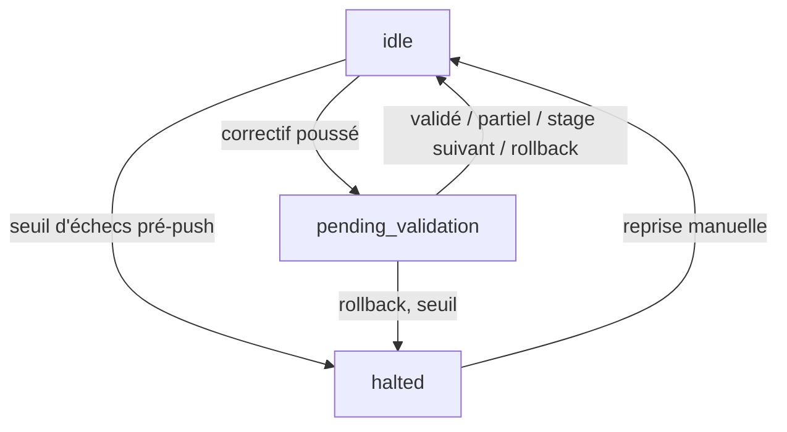
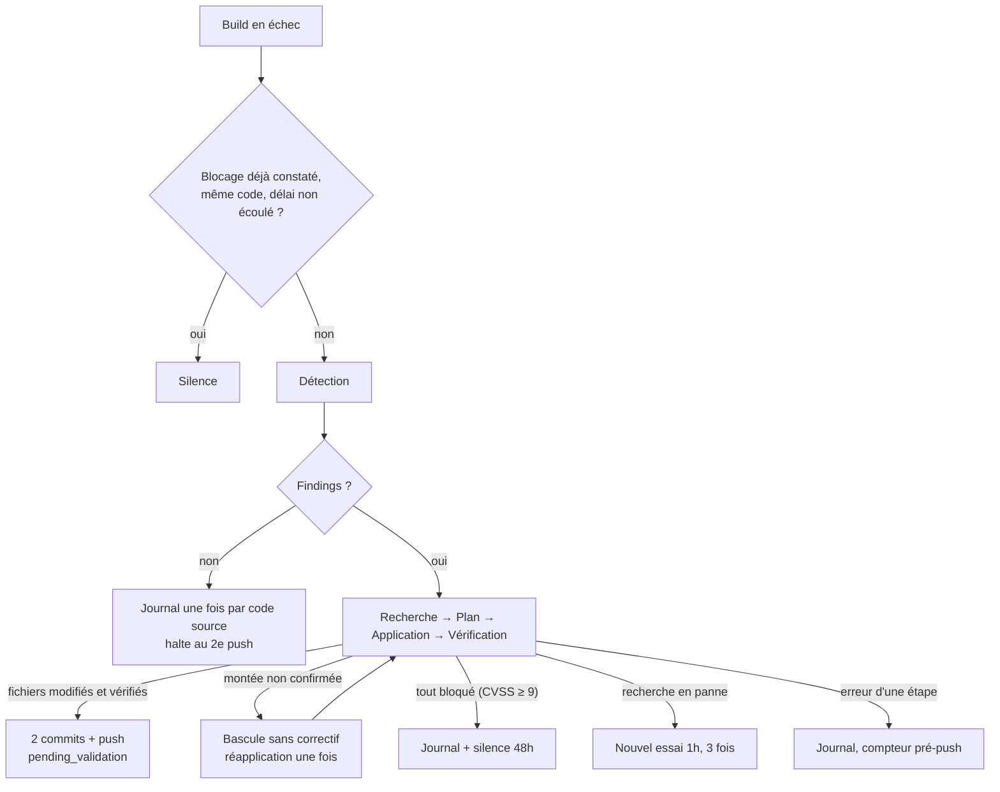

# Remédiation CVE automatisée (fixcve-auto)

Automatisation complète de la remédiation des CVE bloquantes détectées par Trivy ou OWASP Dependency-Check dans le pipeline `RHDemo-CI`, **sans validation humaine**. La procédure est **entièrement déterministe** (aucun LLM) depuis la refonte du 2026-10-09 (voir [FIXCVE_AUTO_TODO.md](FIXCVE_AUTO_TODO.md), section 10). Le skill interactif `/fixcve` réutilise les mêmes scripts avec validation humaine.

**Objectif mesuré** : un cycle n'échoue que face à une CVE **sans correctif publié, CVSS ≥ 9 et sans critère A** (« échec conforme »). Tout autre échec est un défaut de la procédure, compté par l'indicateur `fixcve-stats.py` (voir « Indicateur »).

---

## Architecture

```text
crontab (toutes les 15 min)
   └─> rhDemo/scripts/fixcve-auto-poll.sh   (bash, racine de confiance, copie de travail principale)
         │  synchronise le clone isolé, vérifie l'empreinte des scripts (épinglage de confiance)
         │
         ├─ Phase A (idle) : nouveau build Jenkins en échec sur un stage Trivy/OWASP
         │     1. fixcve-detect.py    -> detected.json   rapports Jenkins -> findings
         │     2. fixcve-resolve.py   -> lookup.json     avis OSV + registres -> version corrigée
         │     3. fixcve-classify.py  -> plan.json       politique : upgrade / A / B / blocage
         │     5. fixcve-apply.py     -> fichiers modifiés + événements d'audit préparés
         │     6. fixcve-verify.py    -> vérification locale (syntaxe, npm, Dependency-Check)
         │     7. commit du correctif, commit du journal, push
         │     (validation de schéma entre 1, 2 et 3 ; tout échec arrête le cycle avant push)
         │
         └─ Phase B (pending_validation) : build CI suivant, bâti sur le correctif
               ├─ SUCCESS → validé
               ├─ FAILURE, findings traités disparus, aucun nouveau → validation partielle
               ├─ FAILURE, stage d'origine propre, échec sur le scan suivant → validé, stage suivant traité
               └─ sinon → git revert du correctif + halte après 2 rollbacks consécutifs
```

Tout le code est dans [`rhDemo/scripts/`](../scripts/) : les points d'entrée `fixcve-*.py` et la bibliothèque [`fixcve_lib/`](../scripts/fixcve_lib/__init__.py) (un module par responsabilité, décrits dans son `__init__.py`).

### Étapes et sources de vérité

| Étape | Script | Source de vérité | Sortie |
| --- | --- | --- | --- |
| 1. Détection | `fixcve-detect.py` | Rapports Jenkins (HTML OWASP DC, JSON Trivy) | `detected.json` |
| 2. Recherche | `fixcve-resolve.py` (`fixcve_lib/resolve.py`) | **Avis OSV.dev** (plage corrigée par branche, alias CVE ↔ GHSA), confirmé par le registre (Maven Central, npm, quay.io / Docker Hub / ghcr.io) ; `npm audit`, `package-lock.json`, `mvnw dependency:list` | `lookup.json` |
| 3. Classification | `fixcve-classify.py` (`fixcve_lib/policy.py`) | Table de décision ci-dessous | `plan.json` |
| 5. Application | `fixcve-apply.py` (`apply.py`, `edits.py`, `suppressions.py`, `advisories.py`) | Plan validé | fichiers de remédiation, `apply-result.json` |
| 6. Vérification | `fixcve-verify.py` (`verify.py`) | Parseurs XML/YAML/JSON, lockfile, `npm audit`, rescan Dependency-Check local | `verify.json` |

Les fichiers de cycle vivent dans `rhDemo/.fixcve-cycle/` (gitignoré) et sont archivés dans `~/.config/rhdemo-fixcve/cycle/archive/<build>-<étape>.json` (post-mortem, rejeu en test).

### Table de décision (étape 3)

| Situation | Action | Résultat |
| --- | --- | --- |
| Version corrigée publiée dans la **même branche majeure** | `upgrade` | `fixed` |
| Recherche en panne (OSV et registre injoignables) | `transient` : rien n'est supprimé, nouvel essai dans 1 h (3 fois, puis 48 h et alerte) | `transient` |
| Sans correctif, **critère A** vérifié | `suppress_permanent` | `accepted_permanent` |
| Sans correctif, CVSS < 9.0 | `suppress_temporary` (**critère B**, jeton `[PENDING_UPSTREAM_FIX]`) | `accepted_temporary` |
| Sans correctif, CVSS ≥ 9.0, sans critère A | `blocked`, journalisé, revue humaine | `blocked_no_fix_ge9` (échec conforme) |

**Critère A** (inexposition objective, prime sur le CVSS) : paquet npm dont toutes les copies sont `dev` dans `package-lock.json` ; dépendance Maven du projet dont toutes les portées sont `test`/`provided` ; vecteur CVSS `AV:L`/`AV:P`. Un jugement contextuel (code vulnérable non atteint dans notre configuration) n'est **jamais** automatique : c'est une décision humaine (skill `/fixcve`, critère `A:decision_humaine`).

Une montée qui ne peut pas être appliquée ou que la vérification ne confirme pas retombe **une fois** dans la branche « sans correctif » de la table (A, B ou blocage) ; le plan est réappliqué et revérifié.

### Montées de version (étape 5)

- **npm** : `npm update <paquet> --package-lock-only` ; à défaut `npm install` exact (dépendance directe) ou `overrides` (transitive). Retenue seulement si **toutes** les copies du lockfile atteignent la cible ; sinon fichiers restaurés (incident #845/#847, montée sans effet).
- **Maven** : propriété du BOM Spring Boot qui gère l'artefact (lue dans `spring-boot-dependencies` de `~/.m2`, BOM importé compris, ex. `jackson-2-bom.version`), commentaire `<!-- Fix ... -->`. Artefact non géré par le BOM : pas de montée (retombe en suppression A/B ou blocage).
- **Image tierce** (jar embarqué : Keycloak, nginx, postgres, NGF) : tag candidat issu des versions corrigées annoncées par Trivy, avec le suffixe de variante du tag courant, plus récent que lui, digest lu sur le registre ; référence `dépôt:tag@digest` remplacée dans `Jenkinsfile-CI`, les deux `docker-compose.yml`, `values.yaml` et `init-stagingkub.sh`. Un numéro de bibliothèque (bcprov 1.85) n'est jamais un tag : décision humaine.
- **Paquet système d'image** : aucun tag corrigé déductible sans scanner l'image ; suppression A/B ou blocage selon la table.

### Suppressions (étape 5, `suppressions.py`)

Générées, jamais rédigées : toutes les formes connues de la faille (`<cve>` pour un CVE, `<vulnerabilityName>` pour un GHSA : OSS Index nomme par CVE, Node Audit par GHSA, voir [OWASP_DEPENDENCY_CHECK.md](OWASP_DEPENDENCY_CHECK.md)) ; formes manquantes ajoutées au bloc existant ; portée `groupId` entier pour les groupes à CPE générique (tomcat, log4j, spring-security, jackson...) ; justification dans `<notes>`, jamais en commentaire XML. Trivy : entrée `.trivyignore.yaml` avec jeton `[OSV:<DISTRO>:<branche>]` pour un paquet système.

**Clôture automatique** des suppressions temporaires : à chaque cycle, les blocs `[PENDING_UPSTREAM_FIX]` npm et Maven sont revérifiés (avis OSV + registre) ; si un correctif est publié, toutes les formes de la faille sont retirées et la montée appliquée (événement `pending_fix_resolved`). Les suppressions Trivy (composants d'images tierces) restent à revérifier manuellement (`poll.log` les liste).

---

## Garde-fous

| Garde-fou | Détail |
| --- | --- |
| **Aucun LLM** | Plus aucune surface d'injection de prompt : les rapports et avis externes ne sont lus que par du code ; aucun secret n'est exposé à un modèle. Les textes libres externes (titres de CVE) ne sont jamais recopiés dans un fichier versionné. |
| **Épinglage de confiance** | Les scripts exécutés viennent du clone, donc de la forge. Le poller (racine de confiance, lancé depuis la copie principale) compare leurs empreintes SHA-256 à `~/.config/rhdemo-fixcve/trusted.sha256` et refuse d'agir (ligne `ALERTE` dans `poll.log`) en cas d'écart. Approbation : `fixcve-install.sh --trust`, qui affiche les évolutions depuis la dernière approbation. Un push seul ne peut donc pas changer ce que fait le bot. |
| **Clone git isolé** | `~/fixcve-worktrees/rhdemo` (`chmod 700`), jamais la copie de travail principale ; suit la branche active de celle-ci. |
| **Working tree propre / branche à jour** | Arbre sale (hors journal) ou branche divergente : aucune action ; alerte après 8 cycles (2 h). Retard sur origin : fast-forward. |
| **Validation de schéma** | `fixcve-validate-json.py` entre chaque étape (`detect`, `lookup`, `plan`) : clés exactes, regex/enum, référence croisée, une action et une seule par finding, critère B interdit au-dessus de 9.0, version Trivy imposée pour une image. |
| **Vérification locale avant push** | Syntaxe de chaque fichier modifié ; npm : copies du lockfile et `npm audit` ; OWASP : rescan Dependency-Check local (clé NVD lue dans l'environnement par le plugin, OSS Index désactivé pour préserver le quota) — aucun finding traité ne doit subsister, aucun nouveau sur un paquet monté. Sans clé NVD : événement `local_validation_incomplete`, la preuve revient au build CI. Trivy : pas de scan local, preuve par le build CI. |
| **Deux commits** | Le correctif, puis le journal : un rollback (`git revert` du seul correctif) ne touche jamais au journal append-only. |
| **Validation par SHA** | La phase B ne juge que le build dont le commit contient le correctif (`git merge-base --is-ancestor`), jamais un build intercalé (#749/#750). |
| **Validation par non-régression** | Build rouge après correctif : conservé si les findings traités ont disparu sans nouveau finding (`validation_partial`), ou si le stage d'origine est propre et l'échec porte sur le scan suivant (`validation_stage_cleared`, #890) ; sinon rollback. Cause réelle du rollback journalisée (`failure_stage`, `failure_detail`, #819). |
| **Haltes** | 2 rollbacks consécutifs, 2 échecs pré-push consécutifs (étape en échec, schéma invalide, vérification locale), 2 pushes « sans finding » consécutifs. |
| **Anti-boucles** | Blocage confirmé : silence 48 h sur le même code source ; blocage transitoire : 1 h, 3 essais, sans commit ; hors périmètre (ni Trivy ni OWASP) : jamais committé ; « déjà corrigé sur HEAD » : aucun commit. |
| **Verrou** | `flock` sur `~/.config/rhdemo-fixcve/poll.lock`. |
| **Journal d'audit append-only** | `rhDemo/docs/fixcve-audit.jsonl` (vue `fixcve-audit.md` générée), un `outcome_code` par événement. |

---

## Machine à états


```mermaid
flowchart TD
    IDLE["idle"]
    PEND["pending_validation"]
    HALT["halted"]

    IDLE -- "correctif poussé" --> PEND
    PEND -- "validé / partiel / stage suivant / rollback" --> IDLE
    IDLE -- "seuil d'échecs pré-push" --> HALT
    PEND -- "rollback, seuil" --> HALT
    HALT -- "reprise manuelle" --> IDLE
```

Phase A (`idle`, build en échec sur Trivy/OWASP) :


```mermaid
flowchart TD
    A[Build en échec] --> B{Blocage déjà constaté,\nmême code, délai non écoulé ?}
    B -- oui --> Z[Silence]
    B -- non --> C[Détection] --> D{Findings ?}
    D -- non --> E[Journal une fois par code source\nhalte au 2e push]
    D -- oui --> F[Recherche → Plan → Application → Vérification]
    F -- "fichiers modifiés et vérifiés" --> G[2 commits + push\npending_validation]
    F -- "montée non confirmée" --> H[Bascule sans correctif\nréapplication une fois]
    H --> F
    F -- "tout bloqué (CVSS ≥ 9)" --> I[Journal + silence 48h]
    F -- "recherche en panne" --> J[Nouvel essai 1h, 3 fois]
    F -- "erreur d'une étape" --> K[Journal, compteur pré-push]
```

---

## Indicateur

```bash
rhDemo/scripts/fixcve-stats.py          # tableau par mois
rhDemo/scripts/fixcve-stats.py --json
```

Par mois : cycles, succès, échecs conformes, pannes d'infrastructure (hors taux), défauts par code (`lookup_gap`, `policy`, `bad_fix`, `tooling`, `transient`, `needs_reasoning`) et taux d'échec. Les événements antérieurs au champ `outcome_code` sont classés approximativement (voir `fixcve_lib/outcomes.py`).

---

## Tests

- `rhDemo/scripts/tests/run-all.sh` : tests unitaires hors réseau (OSV, registres, npm injectés), dont les incidents réels rejoués à partir des archives de cycle (`tests/fixtures/`) — registre dans [FIXCVE_AUTO_INCIDENTS.md](FIXCVE_AUTO_INCIDENTS.md).
- `rhDemo/scripts/tests/poll-sandbox.sh <rapports> <commit> <build>` : exécute le vrai poller contre un faux Jenkins (`tests/fake_jenkins.py`) et un dépôt « origin » local, avec le réseau réel (OSV, npm, Maven Central). Variables `PHASE_B=FAILURE` (rollback) et `OFFLINE=1` (recherche en panne). Aucun push vers la forge, aucun credential réel.

---

## Points d'attention

⚠️ L'automatisation **committe et pousse sur la branche courante sans revue humaine**, y compris des acceptations de risque. Choix assumé en échange des garde-fous ci-dessus, à désactiver si le contexte l'exige.

⚠️ **Heuristique Maven** : quand OSV ne relie pas la faille à l'artefact, la cible est la dernière version stable de la même branche mineure (`proof: heuristic`), non prouvée. La vérification locale (avec clé NVD) puis le build CI tranchent.

⚠️ **npm audit hors ligne** renvoie un rapport vide d'apparence valide : une conclusion « sans correctif » exige donc que l'avis OSV ait répondu ; sinon `lookup_failed` (transitoire).

⚠️ **Images tierces** : un composant interne vulnérable sans tag corrigé (CVSS ≥ 9) est un échec conforme ; l'acceptation documentée reste une décision humaine (exemples : bcprov, freemarker, netty dans Keycloak, voir [SECURITY_ADVISORIES.md](SECURITY_ADVISORIES.md)).

⚠️ **Écart CI / local** : le rescan local n'interroge pas OSS Index (quota partagé avec `RHDemo-CI`) ; une faille connue d'OSS Index seul n'est vue que par le build CI (phase B).

⚠️ **Credentials** : `~/.config/rhdemo-fixcve/` (tokens chiffrés SOPS, clé NVD optionnelle) reste lisible par l'utilisateur unix du cron ; aucun confinement réseau ou noyau (microVM, bubblewrap) à ce jour.

---

## Prérequis d'installation

### 1. Comptes externes

- **Jenkins** : un compte dédié (`claude`, **pas** `admin`), lecture seule suffisante.
- **Codeberg** : un compte bot séparé (`fixcvebot-leuwen-lc`), jamais le compte personnel ; distinct de `rhdemo-ci-bot` (Renovate, voir [RENOVATE_AUTOMERGE_CI.md](RENOVATE_AUTOMERGE_CI.md)).
  1. Créer le compte sur `https://codeberg.org`.
  2. L'ajouter comme collaborateur **Write** (pas Admin) de `leuwen-lc/rhdemo`.
  3. Générer un token à scope écriture restreint à `rhdemo`.
  4. Si la branche est protégée, l'ajouter à la liste autorisée en push.
- **Clé AGE personnelle** (`~/.config/sops/age/keys.txt`), voir [SOPS_SETUP.md](SOPS_SETUP.md).
- **Clé API NVD** (optionnelle, recommandée) : rescan Dependency-Check local complet.

### 2. Script d'installation

[`fixcve-install.sh`](../scripts/fixcve-install.sh), idempotent : outils, credentials chiffrés (saisie interactive, jamais d'écrasement), `git-askpass.sh`, `logrotate.conf`, clone isolé, `frontend/node`, installation du skill `/fixcve` versionné ([`fixcve-skills/fixcve/SKILL.md`](../scripts/fixcve-skills/fixcve/SKILL.md)).

```bash
rhDemo/scripts/fixcve-install.sh             # provisionnement
rhDemo/scripts/fixcve-install.sh --nvd-key   # ajoute la clé NVD (saisie masquée, chiffrée SOPS)
rhDemo/scripts/fixcve-install.sh --trust     # approuve les scripts du bot (après chaque évolution)
```

Les commits automatiques portent l'identité `RHDemo FixCVE Bot` (`GIT_AUTHOR_*`/`GIT_COMMITTER_*` exportés par le poller).

### 3. Activation du cron

**Ne pas installer sans avoir relu `fixcve-auto-poll.sh` et les garde-fous.** `crontab -e` :

```cron
*/15 * * * * /home/leno-vo/git/repository/rhDemo/scripts/fixcve-auto-poll.sh >> /home/leno-vo/.config/rhdemo-fixcve/poll.log 2>&1
0 3 * * * /usr/sbin/logrotate --state /home/leno-vo/.config/rhdemo-fixcve/logrotate.state /home/leno-vo/.config/rhdemo-fixcve/logrotate.conf
```

---

## Exploitation

Toute édition de `state.json` se fait sous le verrou : `flock ~/.config/rhdemo-fixcve/poll.lock -c '<commande>'`.

- **Pause** : `jq '.status="halted"'` sur `state.json` (ou commenter la ligne cron).
- **Reprise après halte** : `jq '.status="idle" | .consecutive_rollbacks=0 | .consecutive_prepush_failures=0'`.
- **Revérifier tout de suite un blocage** : `jq '.blocked_confirmed=null'` (inutile après un changement de code : le SHA source change).
- **Rejouer un build** : `jq '.last_processed_build=<build - 1>'`.
- **Journaux** : `poll.log` (chaque passage cron, y compris hors périmètre et blocages transitoires) ; `rhDemo/docs/fixcve-audit.jsonl` (événements à valeur sécurité, versionné) et sa vue `fixcve-audit.md` ; archives de cycle dans `~/.config/rhdemo-fixcve/cycle/archive/`.

---

## Évolution future : exécution via Jenkins

Héberger le poller dans Jenkins (job déclenché par `post { failure }` de `Jenkinsfile-CI`) supprimerait la reconstruction a posteriori du stage fautif et le cron local, au prix d'une machine à états à réécrire et de credentials à migrer vers le Credentials Store. Plus simple depuis que la procédure n'a plus besoin de Claude Code. La **publication par branche de validation** (proposition J du TODO, reportée) en est un prérequis naturel.

## Voir aussi

- [FIXCVE_AUTO_TODO.md](FIXCVE_AUTO_TODO.md) — plan d'évolutions et revue du 2026-10-09
- [FIXCVE_AUTO_INCIDENTS.md](FIXCVE_AUTO_INCIDENTS.md) — incidents, garde-fous et tests associés
- [OWASP_DEPENDENCY_CHECK.md](OWASP_DEPENDENCY_CHECK.md) — parité CI / Renovate, double inscription CVE + GHSA
- [SECURITY_ADVISORIES.md](SECURITY_ADVISORIES.md) — historique des CVE traitées
